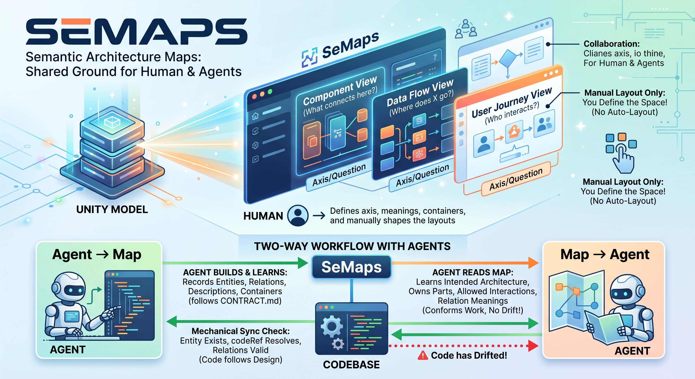

# SeMaps



Semantic architecture maps: one model, several views, each view declares an **axis** —
the question it answers. Layout is manual only; there is no auto-layout.

- The machine checks mechanical sync with code: does the entity exist, does `codeRef` resolve,
  does a relation point anywhere.
- Meaning (containers, axes, texts, views) stays with the human and the agent.

## Two-way work with agents

The map is shared ground between people and coding agents, and it works in both directions:

- **Agent → map.** Following the rules in [`docs/CONTRACT.md`](docs/CONTRACT.md), an agent records
  what it built or learned: entities, relations, descriptions, which container a thing belongs to.
  Views and layout stay human; the agent writes registries and texts, never geometry.
- **Map → agent.** Before changing code, an agent reads the map to learn the intended
  architecture: which part owns what, which interactions are allowed, what a relation means. Its
  work then conforms to the design instead of drifting from it.

The map is the architecture as intended; `semaps check` shows where the model has rotted, and the
sync with code (in progress, see below) will show where the code has moved away from it.

## What exists today

| Part | State |
|---|---|
| Editor (`editor/`) | works: canvas, views, styles, content templates, texts with provenance |
| Host (`host/`) | works: one binary, `*.semaps` project files, save, source viewer |
| `semaps check` (`core/`) | works: stale texts, views without an axis, broken `codeRef`, … |
| Sync with code (`core/`) | works from a facts file: `semaps sync --facts facts.json`; extractors run by `semaps.exe`, `/setup` in the editor — [**planned**](docs/plans/PLAN_20260924_host_setup-and-extract.md) |
| Extractor for TypeScript (`extractors/typescript/`) | **in progress** — [`PLAN_20260923_extractors_typescript`](docs/plans/PLAN_20260923_extractors_typescript.md) |
| Extractor for C# (`extractors/csharp/`) | **in progress** — [`PLAN_20260923_extractors_csharp`](docs/plans/PLAN_20260923_extractors_csharp.md) |
| JSON schema of extractor facts (`schemas/`) | works: [`extractor-facts.schema.json`](schemas/extractor-facts.schema.json) |

## Getting started

### 1. Install — once per machine

**Without Node or Go:** download `semaps.exe` from
[Releases](https://github.com/KOE73/SeMaps/releases) and double-click it. It asks whether to
install for the current user and then copies itself to `%LOCALAPPDATA%\Programs\SeMaps`, adds
that folder to your `PATH` and associates `*.semaps` files with itself. No admin rights. The same
from a console: `semaps.exe install`.

**From source** (needs Go 1.26+ and Node 24+, the editor is built and embedded):

```
git clone https://github.com/KOE73/SeMaps.git
SeMaps\host\install.cmd
```

This builds the editor and `semaps.exe`, then runs the same `install`.

Check: open a new console and type `semaps --help`.

**Extractor for C#** (optional, needs the .NET SDK): download `SeMaps.Extract.CSharp.<version>.nupkg`
from the same Release into a folder and run
`dotnet tool install -g --add-source <that folder> SeMaps.Extract.CSharp`. Check:
`semaps-extract-csharp --root <your repo> --include src > facts.json`.

### 2. Add a project file — once per project

In the **root of your project** (next to `.git`) create `<name>.semaps`, e.g. `myproject.semaps`:

```yaml
version: 1
name: My project
workspace: docs/diagrams   # where the maps live (projects/)
source_root: .             # where the code lives, for codeRef
port: 8777
```

All paths are relative to the folder of this file. All keys are optional — the values above are
the defaults. The file is YAML: comments stay when SeMaps edits it.

`extractors:` lists what to read from the code and into which model project; a repository may
have several (C# and TypeScript side by side). Running them from `semaps.exe` is
[planned](docs/plans/PLAN_20260924_host_setup-and-extract.md); the key is already read and checked.

```yaml
extractors:
  - id: backend
    language: csharp
    project: core            # model project in the workspace
    root: .
    include: [src]
    exclude: ["**/*.Tests/**"]
``` Commit the file: everyone who clones the project gets the same environment.

The workspace folder may start empty: create projects and diagrams in the editor (**Вставка →
Проекты и схемы**), or copy [`examples/workspace`](examples/workspace). There is no list of
diagrams to maintain — a project is a folder in `projects/`, a diagram is a file in its `views/`.
**Справка → Как устроен проект** in the editor draws the layout.

### 3. Open — every day

Any of these:

- **Enter** on `myproject.semaps` in Far / Total Commander, or a **double click** in Explorer;
- type **`semaps`** in a console anywhere inside the project — it walks up to the `*.semaps` file;
- `semaps path\to\myproject.semaps` from anywhere.

The server starts in **its own console window** and your prompt / file manager is free at once;
the browser opens on the editor. To stop, close that window (or Ctrl+C in it). Opening the same
project again does not start a second server — it just brings up the browser.
Edits are saved straight into the workspace folder — review and commit them like code.

### 4. Check — in CI or before a commit

```
semaps check
```

Same project lookup as above. Reports stale translations, texts that are missing, views without
an axis, one node in two containers on the same axis, broken `codeRef`. Exit code 1 when
anything is found, so a consuming project can run it in CI.

### Setting up a map with an agent

Your agent does not have the SeMaps source, so give it the link. Paste into the agent in your
project something like:

```
Set up a SeMaps architecture map in this repository. Follow
https://github.com/KOE73/SeMaps/blob/main/docs/ADOPTING.md
and the format in https://github.com/KOE73/SeMaps/blob/main/docs/CONTRACT.md.
Do not place nodes on views — leave that to me. Do not commit.
```

[`docs/ADOPTING.md`](docs/ADOPTING.md) lists the steps and the traps.

### Try it without a project

```
semaps SeMaps\examples\example.semaps
```

### Updating

A new exe from Releases, or `git pull` and `host\install.cmd` again — the editor is inside the
exe, so an old exe means an old editor.

## Extractors: one per language, yours is welcome

An extractor is a separate program for one language. It reads the sources and prints facts
about the code (types, interfaces, functions, who extends and references whom) as one JSON
document; `semaps sync` in the host turns those facts into the registry. The extractor never
writes files and knows nothing about views, texts or containers, so writing one for a new
language is a small, well-bounded job:

- the contract: [`docs/EXTRACTOR.md`](docs/EXTRACTOR.md), the output schema:
  [`schemas/extractor-facts.schema.json`](schemas/extractor-facts.schema.json), the shape of
  symbol ids: [`ADR_20260923-5`](docs/adr/ADR_20260923-5_extractors_symbol-ids.md);
- two reference implementations: `extractors/typescript/` (runs on SeMaps' own editor) and
  `extractors/csharp/` (Roslyn).

If you want an extractor for your language, take one of the two as a template and open a PR.

## Layout

| Path | What |
|---|---|
| `editor/` | canvas editor, TypeScript (`@semaps/editor`) |
| `host/` | `semaps` binary, Go: serves the editor and a workspace |
| `core/` | language-neutral check and sync, Go, part of the `semaps` binary |
| `extractors/<lang>/` | one process per language, prints code facts as JSON (planned) |
| `schemas/` | JSON schemas: workspace contract, extractor facts (planned) |
| `docs/` | CONTRACT, API, EXTRACTOR, ADR, plans |
| `agents/` | rules for agents; documentation genres and naming |
| `examples/workspace/` | minimal workspace to open |

A consuming project keeps only its workspace (`docs/diagrams/`) — no Node, no Go.

The built editor (`host/app/`) is not in git: CI builds it and embeds it into the release
binaries ([`ADR_20260923-3`](docs/adr/ADR_20260923-3_build_bundle-from-ci-not-git.md)).

## License

[MIT](LICENSE).
