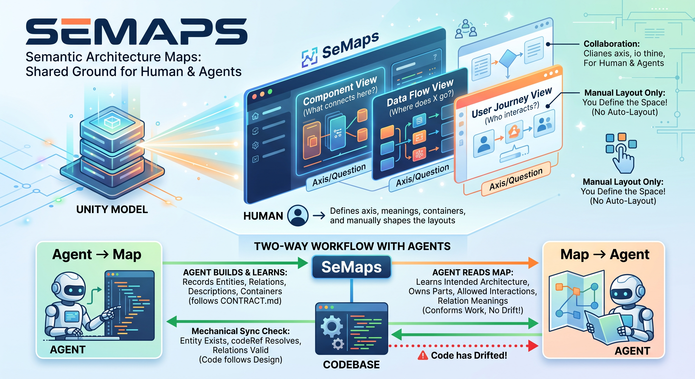
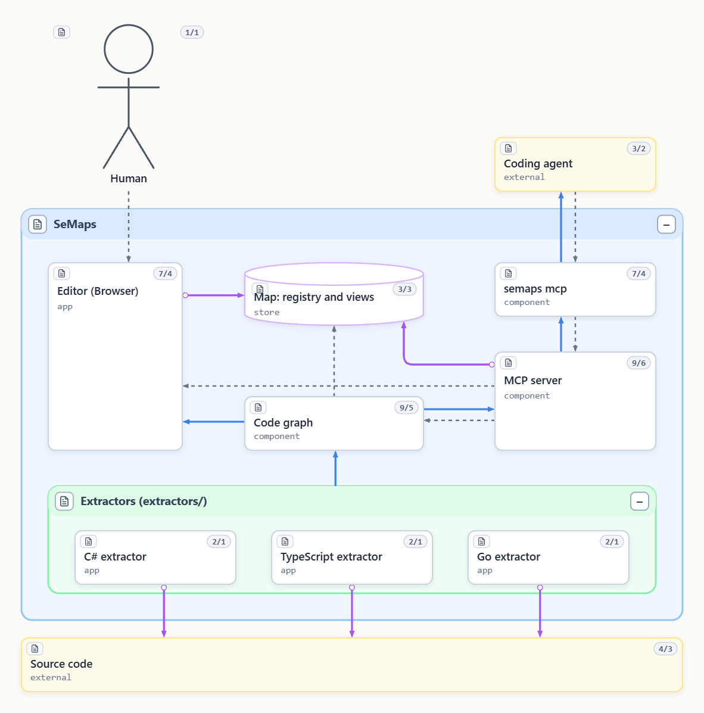
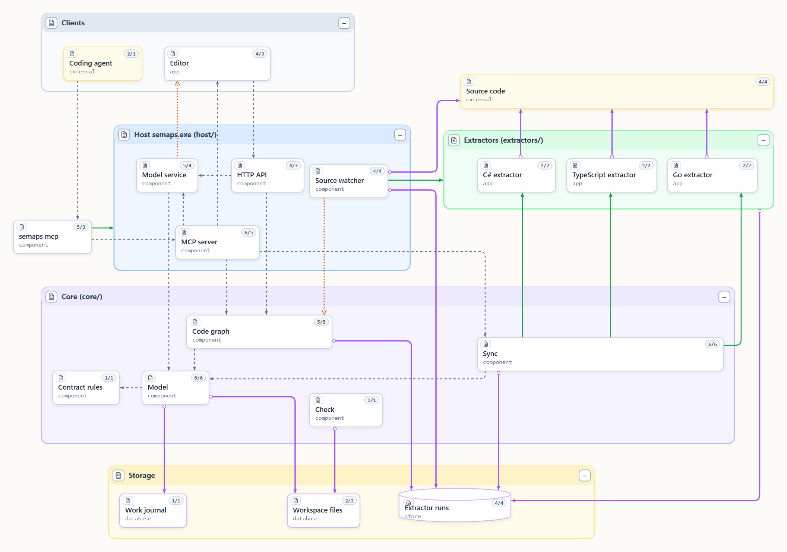
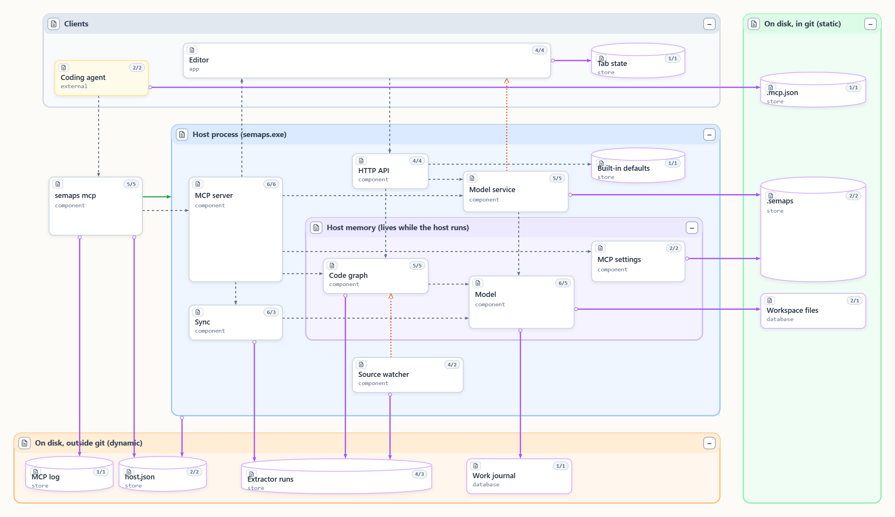

# SeMaps



Семантические карты архитектуры для людей и агентов: одна модель, много схем, сверка с кодом и
MCP-сервер, через который агент читает и правит архитектуру так же, как ты.



Человек работает с картой в редакторе, агент — через MCP, и карта у них одна. Под ней живой код:
экстракторы читают его и строят граф кода, который сверяется с картой.

## Чем SeMaps хорош

- **Архитектура, которую читает и агент.** Подключи `semaps mcp`, и агент перед правкой кода
  узнаёт по карте, что где лежит и как устроено. Про код он спрашивает граф, а не ищет по
  тексту: это быстрее и тратит в разы меньше токенов. После работы он сам записывает на карту
  то, что построил.
- **Агент рисует схемы вместе с тобой.** По твоей просьбе он раскладывает блоки, показывает
  нужные связи и смотрит на результат картинкой, а не вслепую.
- **Карта не врёт про код.** Экстракторы для C#, TypeScript и Go читают исходники.
  `semaps check` в CI ловит места, где карта разошлась с кодом.
- **Живой граф кода.** Весь код одним графом, который сам перестраивается, пока ты пишешь код.
  Нужные узлы переносятся на схему.
- **Человек и агент в одной модели одновременно.** Изменения сразу видны во всех окнах, а
  панель «Изменения» показывает, кто что поменял до сохранения.
- **Одна модель — много схем.** У каждой схемы своя ось — вопрос, на который она отвечает.
  Связь заводится один раз и появляется везде, где есть оба её конца.
- **Редактор для архитектора.** Связь создаётся протягиванием мышью, линии сами обходят блоки, а
  раскладка остаётся твоей.

### Архитектура, которую читает и агент

Карта — общая почва для людей и агентов, и работает она в обе стороны.

- **Карта → агент.** Прежде чем менять код, агент читает карту и узнаёт задуманную архитектуру:
  какая часть чем владеет, какие взаимодействия разрешены, что значит связь. Его работа следует
  замыслу, а не уходит от него.
- **Агент → карта.** Агент записывает, что построил или узнал: сущности, связи, описания,
  принадлежность к контейнерам. Пишет он только через инструменты MCP, а хост проверяет каждую
  правку теми же правилами, что и правки человека. Файлы рабочего пространства агент руками не
  трогает. Их формат описан в [`docs/CONTRACT.md`](docs/CONTRACT.md).

- **Граф вместо поиска по тексту.** Кто наследует тип, кто его держит, вызывает или создаёт,
  что лежит в пространстве имён — агент спрашивает граф кода и одним вызовом получает ответ с
  файлами и строками. Не нужно перебирать grep и читать файлы целиком: быстрее и в разы меньше
  токенов. Открывать стоит только строки, которые назвал граф.

Всё это через `semaps mcp` — MCP-сервер, который подключается к Claude Code и другим клиентам
одной строкой в `.mcp.json`. В редакторе есть режим **MCP**. Там видно, что сервер даёт, как его
подключить, и есть песочница: можно вызвать любой инструмент и увидеть запрос и ответ.

### Агент рисует схемы вместе с тобой

Агент получает схему деревом контейнеров и блоков. Он может двигать блоки, выравнивать их,
раскладывать по контейнерам, показывать и прятать связи целыми типами. Раскладку он меняет только
по просьбе человека. Чтобы не работать вслепую, агент рисует любую схему проекта картинкой
(`render_view`) и видит то же, что увидишь ты.

### Карта не врёт про код

Экстракторы читают исходники и отдают факты: типы, интерфейсы, наследование, кто кого держит
и через какой член, с кратностью и местом в коде. `semaps sync` превращает факты в реестр
модели, а `semaps check` проверяет, что ссылки карты на код живы, тексты не устарели и у каждой
схемы есть ось. Код выхода 1 при находке, так что проверку можно ставить в CI.

В граф попадают только однозначные факты: SeMaps не гадает. Экстрактор для своего языка — это
небольшая отдельная программа, и PR с ним приветствуется (см. ниже).

### Живой граф кода

Страница графа (`/app/#graph`) показывает весь код сразу. Раскладка автоматическая, узлы
группируются по коду, по модели или по структуре и раскрашиваются по группам. Хост следит за
исходниками: сохранил файл — граф обновился. Агенту граф отвечает на вопросы вроде «что от
этого наследуется до самого низа», «кто это держит», «кто это вызывает и где». Узлы графа можно
скопировать и вставить на схему: так из кода быстро получается архитектурная картинка.

### Человек и агент в одной модели

Редактор и агенты работают с одной рабочей моделью в хосте. Что приняла модель, сразу видно во
всех открытых окнах и не теряется при перезапуске. Панель **«Изменения»** показывает
несохранённое и кто это внёс, человек или агент. **Сохранить** пишет файлы в рабочее
пространство. Дальше их просматривают и коммитят как обычный код.

Ошибочную ручную запись — сущность или связь — можно удалить: человеку из редактора, агенту
через MCP по просьбе человека. Удаление тоже ждёт сохранения, так что передумать не поздно.
Записи, которые принесла сверка с кодом, так не удаляются: их судьбу решает код.

### Одна модель — много схем

Сущности и связи живут в реестре проекта, а схема — это взгляд на них со своей осью: «из чего
состоит», «кто кого вызывает», «где хранятся данные». Связь заводится один раз. Каждая схема
сама решает, показывать её или нет, и связь появляется везде, где есть оба её конца.

Например, у самого SeMaps есть две схемы на одном реестре ([`docs/diagrams/`](docs/diagrams/)).
Общая архитектура: клиенты, хост, ядро, хранение, экстракторы и код.



Устройство изнутри: что лежит в git, что на диске вне git, что живёт только в памяти хоста и
откуда MCP берёт данные.



### Редактор для архитектора

- Задержи мышь на блоке: под ним появится стрелка. Потяни её на другой блок и выбери тип связи.
  Или выдели несколько блоков и через ПКМ выбери **Создать связь**.
- Линии сами обходят блоки, держатся подальше от их краёв и проходят по свободному месту между
  контейнерами. Сторону блока, к которой подходит линия, выбирает сам поиск пути, а прямые
  встают посередине общего участка.
- Разводку можно подстроить под себя: в панели **«Разводка линий»** ползунками меняются отступы,
  ореолы и цены поворотов. Схема перерисовывается сразу, а зоны видны и на холсте, и на
  маленькой схеме в масштабе.
- При перетаскивании заново прокладываются только линии двигаемых блоков, поэтому даже большая
  схема тянется плавно.
- Раскладка только ручная, автоматически ничего не переставляется: схема остаётся такой, какой
  ты её задумал. Алгоритмическая раскладка есть только на странице графа кода, и это нарочно
  ([`ADR_20260928-2`](docs/adr/ADR_20260928-2_editor_graph-is-a-separate-form.md)).

Что изменилось в каждой версии — в [CHANGELOG.md](CHANGELOG.md).

## Что есть сейчас

| Часть | Состояние |
|---|---|
| Редактор (`editor/`) | работает: холст, схемы, стили, шаблоны содержимого, тексты с происхождением, ручные связи |
| Хост (`host/`) | работает: один бинарник, файлы проектов `*.semaps`, общая рабочая модель с журналом, сохранение, просмотр исходников |
| MCP-сервер (`semaps mcp`) | работает: чтение и запись модели, инструменты схем, вопросы к графу кода |
| `semaps check` (`core/`) | работает: устаревшие тексты, схемы без оси, сломанные `code[].ref`, … |
| Сверка с кодом (`core/`) | работает: `semaps sync` запускает экстракторы из `.semaps`; страницы `/extract` и `/setup` в редакторе |
| Экстрактор для TypeScript (`extractors/typescript/`) | работает: типы, связи членов, позиции в коде |
| Экстрактор для C# (`extractors/csharp/`) | работает: типы, связи членов, позиции, методы и вызовы |
| Экстрактор для Go (`extractors/go/`) | работает: типы, неявные реализации интерфейсов, связи членов, позиции; таблица соответствий — [`docs/extractors/go.md`](docs/extractors/go.md) |
| JSON-схема фактов экстрактора (`schemas/`) | работает: [`extractor-facts.schema.json`](schemas/extractor-facts.schema.json) |
| Страница графа кода (`editor/`, `/app/#graph`) | работает: sigma + graphology, алгоритмическая раскладка, живые обновления |
| Слежение за исходниками (`host/`) | работает: `watch` у экстрактора перезапускает его при изменении исходников и обновляет только граф |

## С чего начать

### 1. Установка — один раз на машину

**Без Node и Go:** скачай `semaps-windows-amd64.zip` со страницы
[Releases](https://github.com/KOE73/SeMaps/releases), распакуй и запусти `semaps.exe` двойным
кликом. Он спросит, ставить ли для текущего пользователя, затем скопирует себя и папку
`extractors\` в `%LOCALAPPDATA%\Programs\SeMaps`, добавит эту папку в `PATH` и свяжет с собой
файлы `*.semaps`. Права администратора не нужны. То же из консоли: `semaps.exe install`. Голый
`semaps.exe` с той же страницы тоже работает, но без экстракторов.

**Из исходников** (нужны Go 1.26+ и Node 24+; редактор собирается и встраивается):

```
git clone https://github.com/KOE73/SeMaps.git
SeMaps\install.cmd
```

Собирается редактор, `semaps.exe` и экстракторы (Go всегда, C#, если есть `dotnet`, TypeScript,
если есть `npm`), затем выполняется тот же `install`.

Проверка: открой новую консоль и набери `semaps --help`.

**Экстракторы** лежат в той же папке (`extractors\csharp`, `extractors\typescript`,
`extractors\go`). Каждому нужна среда своего языка: .NET для C#, Node 24+ для TypeScript, Go
для Go (он читает пакеты через `go list`). `semaps doctor` в проекте скажет,
что найдено и чего не хватает.

### 2. Файл проекта — один раз на проект

В **корне своего проекта** (рядом с `.git`) создай `<имя>.semaps`, например `myproject.semaps`:

```yaml
version: 1
name: My project
workspace: docs/diagrams   # где живут карты (projects/)
source_root: .             # где живёт код, для путей code[].ref
port: 8777
```

Все пути — относительно папки этого файла. Все ключи необязательны, выше — значения по
умолчанию. Файл в YAML: комментарии сохраняются, когда SeMaps его правит.

`extractors:` перечисляет, что читать из кода и в какой проект модели; в одном репозитории их
может быть несколько (C# и TypeScript рядом). `semaps sync` запускает их и обновляет реестр; в
редакторе то же самое — на странице **Экстракторы**, а настройки этого файла — на странице
**Настройки**.

```yaml
extractors:
  - id: backend
    language: csharp
    project: core            # проект модели в рабочем пространстве
    root: .
    include: [src]
    exclude: ["**/*.Tests/**"]
```

Закоммить файл: у каждого, кто склонирует проект, будет то же окружение.

Папка рабочего пространства может быть пустой: проекты и схемы создаются в редакторе
(**Вставка → Проекты и схемы**), или скопируй [`examples/workspace`](examples/workspace). Списка
схем вести не нужно: проект — это папка в `projects/`, схема — файл в её `views/`.
**Справка → Как устроен проект** в редакторе рисует устройство.

### 3. Открытие — каждый день

Любой из способов:

- **Enter** на `myproject.semaps` в Far / Total Commander или **двойной клик** в Проводнике;
- **`semaps`** в консоли где угодно внутри проекта — он поднимется вверх до файла `*.semaps`;
- `semaps path\to\myproject.semaps` откуда угодно.

Сервер запускается **в своём окне консоли**, а твоя консоль или файловый менеджер сразу
свободны; браузер открывается на редакторе. Чтобы остановить, закрой это окно (или Ctrl+C в
нём). Повторное открытие того же проекта не запускает второй сервер, а просто открывает браузер.
Редактор и MCP-агенты работают с общей рабочей моделью хоста. Принятые изменения сразу видны в
открытых окнах и переживают перезапуск в локальном журнале. **Сохранить** пишет изменённые файлы
контракта в рабочее пространство; панель **«Изменения»** показывает, что не сохранено и что
внёс агент. Просмотри изменения и закоммить их как код. Создать или переименовать проект или
схему можно только после сохранения их текущих изменений.

### Настройка карты с агентом

У твоего агента нет исходников SeMaps, поэтому дай ему ссылку. Вставь агенту в своём проекте
что-то вроде:

```
Set up a SeMaps architecture map in this repository. Follow
https://github.com/KOE73/SeMaps/blob/main/docs/ADOPTING.md:
connect the semaps MCP server and do everything through its tools.
Do not place nodes on views — leave that to me. Do not commit.
```

[`docs/ADOPTING.md`](docs/ADOPTING.md) перечисляет шаги и ловушки. Дальше агент работает через
MCP: файлы рабочего пространства он руками не правит.

### Попробовать без проекта

```
semaps SeMaps\examples\example.semaps
```

### Обновление

Новый exe со страницы Releases, или `git pull` и снова `install.cmd`: редактор внутри exe, так
что старый exe — это старый редактор. `install.cmd` сначала завершает все запущенные
`semaps.exe` (открытые редакторы, MCP-серверы сессий агентов) и все exe, запущенные из папки
установки: после этого переоткрой редактор и перезапусти сессии агентов.

## Экстракторы: по одному на язык, твой — приветствуется

Экстрактор — отдельная программа для одного языка. Он читает исходники и печатает факты о коде
(типы, интерфейсы, функции, кто кого наследует и на кого ссылается) одним JSON-документом;
`semaps sync` в хосте превращает эти факты в реестр. Экстрактор никогда не пишет файлы и ничего
не знает о схемах, текстах и контейнерах, поэтому написать его для нового языка — небольшая и
хорошо ограниченная работа:

- контракт: [`docs/EXTRACTOR.md`](docs/EXTRACTOR.md), схема вывода:
  [`schemas/extractor-facts.schema.json`](schemas/extractor-facts.schema.json), вид
  идентификаторов символов: [`ADR_20260923-5`](docs/adr/ADR_20260923-5_extractors_symbol-ids.md);
- таблица соответствий для каждого языка: [`docs/extractors/`](docs/extractors/);
- три образца: `extractors/typescript/` (работает на собственном редакторе SeMaps),
  `extractors/csharp/` (Roslyn) и `extractors/go/`.

Если хочешь экстрактор для своего языка — возьми один из них за образец и открой PR.

## Устройство репозитория

| Путь | Что |
|---|---|
| `editor/` | редактор-холст, TypeScript (`@semaps/editor`) |
| `host/` | бинарник `semaps`, Go: отдаёт редактор и рабочее пространство, MCP-сервер |
| `core/` | проверка и сверка, не зависящие от языка, Go, часть бинарника `semaps` |
| `extractors/<язык>/` | по процессу на язык, печатает факты о коде в JSON |
| `schemas/` | JSON-схема фактов экстрактора |
| `docs/` | CONTRACT, API, EXTRACTOR, ADOPTING, ADR, планы |
| `agents/` | правила для агентов; жанры документации и именование |
| `examples/workspace/` | минимальное рабочее пространство, чтобы открыть |

Проект-потребитель хранит только своё рабочее пространство (`docs/diagrams/`) — без Node и Go.

Собранный редактор (`host/app/`) не лежит в git: CI собирает его и встраивает в бинарники
релиза ([`ADR_20260923-3`](docs/adr/ADR_20260923-3_build_bundle-from-ci-not-git.md)).

## Лицензия

[MIT](LICENSE).
